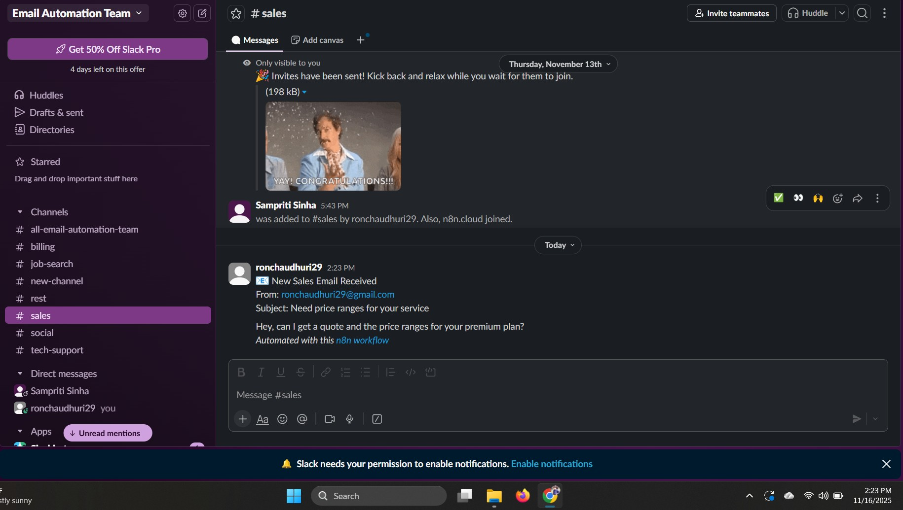
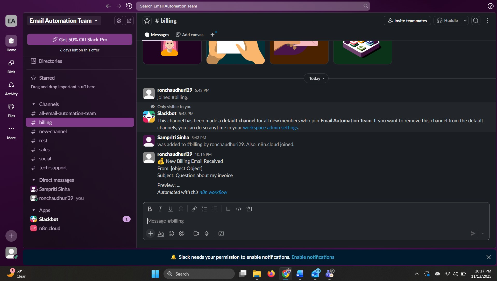
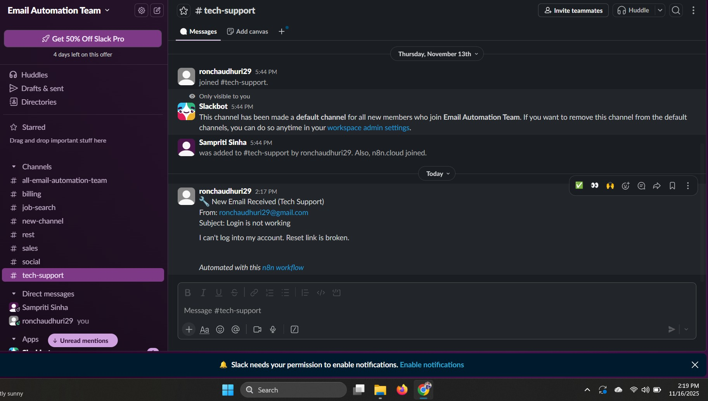
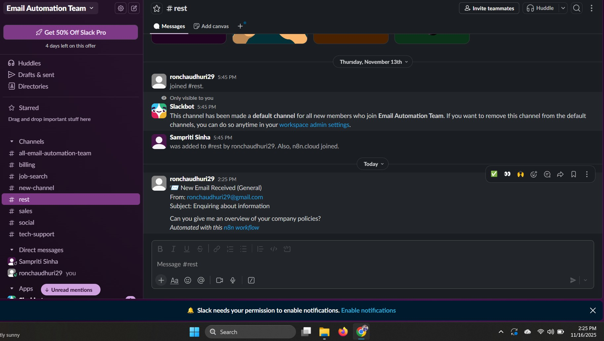

# 📧 Automated Email Classification & Routing (n8n + OpenAI + Slack + MySQL)

This project implements a fully automated workflow for classifying and routing incoming emails using **n8n**, **OpenAI GPT-4o-mini**, **Gmail API**, **MySQL**, and **Slack**. Incoming emails are analyzed using AI, categorized into sales, billing, tech-support, or general, logged into a database, and routed to the appropriate Slack channels in real time.

---

## 🚀 Workflow Overview

```
Gmail Trigger  
      ↓
OpenAI (GPT-4o-mini Classification)  
      ↓
CombineData / Set Node  
      ↓
MySQL (Insert into `emails` table)  
      ↓
Switch Router  
   ├── Slack – Sales  
   ├── Slack – Billing  
   ├── Slack – Tech Support  
   └── Slack – General (Rest)
```

---

## 🧠 How It Works

- **Gmail Trigger** listens for new incoming emails using OAuth2 authentication.  
- **OpenAI** classifies the content of the email into four predefined categories based on subject and body text.  
- **CombineData** prepares structured fields (sender, subject, preview, category, timestamp).  
- **MySQL** stores each processed email for audit and historical logging.  
- **Switch Node** evaluates the category returned by OpenAI and routes the message to the appropriate Slack channel.  
- **Slack** posts a clean, formatted message showing the classification result and email details.

---

## 📸 Slack Output (Screenshots)

### **Sales**


### **Billing**


### **Tech Support**


### **General / Rest**


---

## 📂 Repository Structure

```
/images
   ├── EmailClassificationAndRouting_Sales.jpg
   ├── EmailClassificationAndRouting_Billing.jpg
   ├── EmailClassificationAndRouting_TechSupport.jpg
   └── EmailClassificationAndRouting_Rest.jpg

EmailClassificationAndRouting.json
README.md
```

---

## 🔧 Technologies Used

- **n8n** – workflow automation platform  
- **OpenAI GPT-4o-mini** – email classification  
- **Gmail API (OAuth2)** – email ingestion  
- **Slack API** – automated messaging  
- **MySQL (Aiven Cloud)** – data logging  
- **JavaScript Expressions inside n8n** – data transformation  

---

## 🏁 How to Run This Workflow

1. **Import** the file `EmailClassificationAndRouting.json` into your n8n workspace.  
2. Configure the following **credentials** in n8n:  
   - Gmail OAuth2  
   - OpenAI API Key  
   - Slack App OAuth Token  
   - MySQL connection (Aiven or local)  
3. Create these Slack channels in your workspace:  
   - `#sales`  
   - `#billing`  
   - `#tech-support`  
   - `#rest`  
4. Send test emails to your own Gmail inbox using keywords:  
   - Pricing / quote → Sales  
   - Invoice / refund → Billing  
   - Login error / bug → Tech Support  
   - Anything else → Rest  
5. Run the workflow manually or activate scheduled polling.  
6. Check Slack for categorized notifications and MySQL for stored logs.

---

## 📄 Workflow JSON

The complete automation workflow is available in:

**`EmailClassificationAndRouting.json`**

---

## 📌 License

This project is provided for educational and demonstration purposes.
